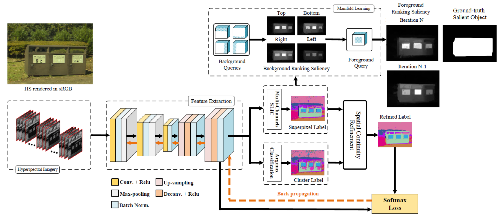
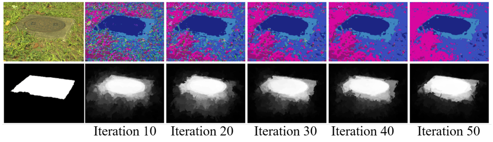
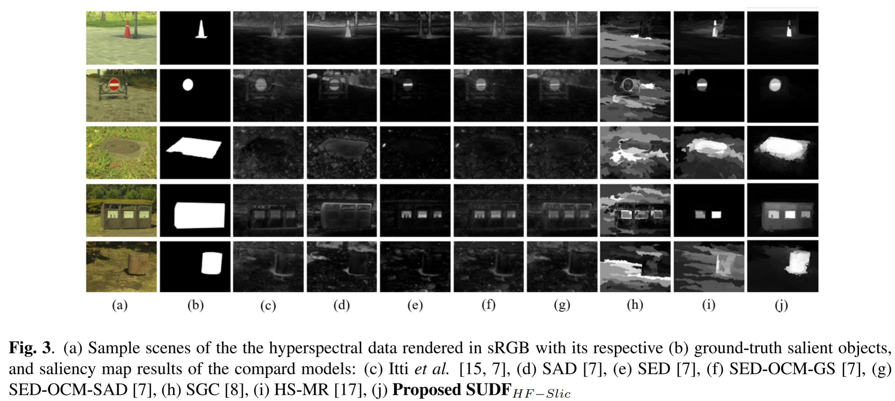

# Salient object detection on hyperspectral images using features learned from unsupervised segmentation task

This pytorch code was implemented by Nevrez Imamoglu and Guanqun Ding for the following paper:

Nevrez Imamoglu, Guanqun Ding, Yuming Fang, Asako Kanezaki, Toru Kouyama, Ryosuke Nakamura, "Salient object detection on hyperspectral images using features learned from unsupervised segmentation task", 
in IEEE International Conference on Acoustics, Speech, and Signal Processing (ICASSP), 2019. ([pdf](https://arxiv.org/pdf/1902.10993.pdf))

## Requirements

python3.6, pytorch, scipy==1.2.0,opencv-python, h5py, scikit-image==0.14.0

install torch: 
`sudo pip3 install torch torchvision`

install opencv: 
`sudo pip3 install opencv-python`

## Getting started
- put your HS data into folder `./HS_images`, you can download our HS-SOD Dataset from [here](http://www.google.com/url?q=http%3A%2F%2Fdata.airc.aist.go.jp%2FHS-SOD%2FHS-SOD.zip&sa=D&sntz=1&usg=AFQjCNHJq_RlibTFQ83XuPzi4xcDoOb5lg),
([pdf](https://arxiv.org/pdf/1806.11314.pdf), [project](https://github.com/gistairc/HS-SOD), [dataset](http://www.google.com/url?q=http%3A%2F%2Fdata.airc.aist.go.jp%2FHS-SOD%2FHS-SOD.zip&sa=D&sntz=1&usg=AFQjCNHJq_RlibTFQ83XuPzi4xcDoOb5lg))
- run the script on bash
`sh run.sh`
- after iteration, you can find the training results in folder './HS_Results', the final saliency maps can be found in './HS_Results/sal_result'

## Results

### Iteration Results

### Visualization Results

If this code is useful for your research, please cite the following paper:

[1] Nevrez Imamoglu, Guanqun Ding, Yuming Fang, Asako Kanezaki, Toru Kouyama, Ryosuke Nakamura, "Salient object detection on hyperspectral images using features learned from unsupervised segmentation task", 
in IEEE International Conference on Acoustics, Speech, and Signal Processing (ICASSP), 2019. ([pdf](https://arxiv.org/pdf/1902.10993.pdf))

[2] Asako Kanezaki, "Unsupervised Image Segmentation by Backpropagation", in IEEE International Conference on Acoustics, Speech and Signal Processing (ICASSP)*, 2018.
([pdf](https://kanezaki.github.io/pytorch-unsupervised-segmentation/ICASSP2018_kanezaki.pdf))

[3] Nevrez Imamoglu, Yu Oishi, Xiaoqiang Zhang, Guanqun Ding, Yuming Fang, Toru Kouyama, Ryosuke Nakamura, "Hyperspectral Image Dataset for Benchmarking on Salient Object Detection", 10th International Conference on Quality of Multimedia Experience (QoMEX), Sardinia, Italy, May 29 - June 1, 2018. 
([pdf](https://arxiv.org/pdf/1806.11314.pdf), [project](https://github.com/gistairc/HS-SOD), [dataset](http://www.google.com/url?q=http%3A%2F%2Fdata.airc.aist.go.jp%2FHS-SOD%2FHS-SOD.zip&sa=D&sntz=1&usg=AFQjCNHJq_RlibTFQ83XuPzi4xcDoOb5lg))

## Acknowledgement

This code was based on the Asako Kanezaki's awesome work:
Asako Kanezaki, "Unsupervised Image Segmentation by Backpropagation", in IEEE International Conference on Acoustics, Speech and Signal Processing (ICASSP)*, 2018.
([pdf](https://kanezaki.github.io/pytorch-unsupervised-segmentation/ICASSP2018_kanezaki.pdf))

